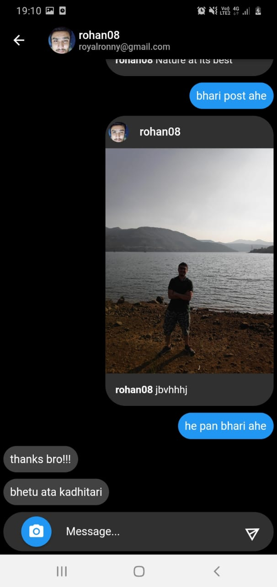
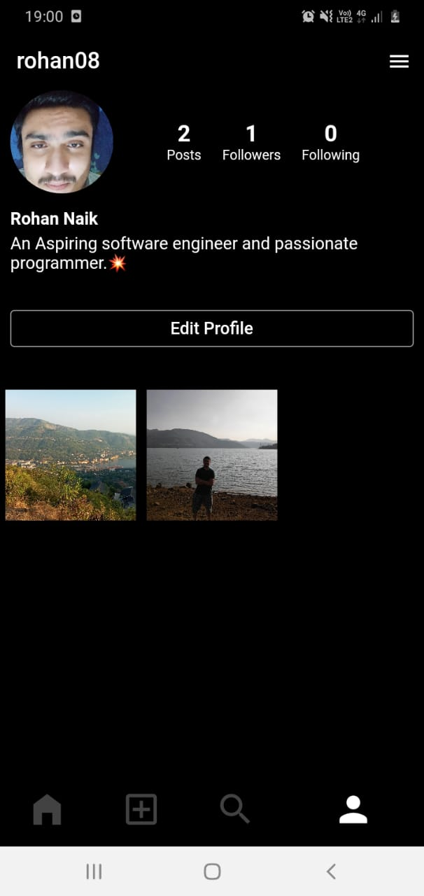

# Instagram Clone

A fully functional Instagram Clone which you can discover people,create and share posts,like and comment on each other's posts and chat with one another. This cross platform application is completely built using Flutter framework using sophisticated state management techniques like Provider and Firebase server as a backend.

|----------|

## How to Run the App
<ol>
  <li>Download Flutter SDK and Dart and configure it as per your system</li>
  <li>Run 'flutter doctor' to check if all local development environment configurations are met</li>
  <li> Create an new Project on Firebase and add an configure an Android/IOS Application</li>
  <li> Add the google-services.json file to the android/app/ directory. 
    (Make sure to gitignore this file as it contains API key and other information to access the backend)</li>
  <li> Run the  command 'flutter pub get' to install required dependencies </li>
  <li> Run the application using the command 'flutter run --no-sound-null-safety' as some of the dependencies are not null-safe otherwise your app will not build</li>
</ol>

## Contribution guidelines
Open source contributions are always welcome for improvement of this app. If you have a cool feature to add or a bug fix,please make sure to follow below guidelines to avoid lack of clarity.
<ol>
  <li>Fork this project.</li>
  <li>Create a new branch named as 'Feature/your-feature' or 'Bug-Fix/your-fix' after pulling the code.</li>
  <li>Commit your changes with a clear and concise commit message</li>
  <li>Push the code to the corresponding remote branch and open a pull request with a small description of your changes.</li>
</ol>

## Upcoming features
<ol>
  <li>Stories Module</li>
  <li>Activity Module</li>
  <li>Follow Request Module and Private Account Feature</li>
  <li>App notifications,etc...</li>
</ol>

A few resources to get you started if this is your first Flutter project:

- [Lab: Write your first Flutter app](https://flutter.dev/docs/get-started/codelab)
- [Cookbook: Useful Flutter samples](https://flutter.dev/docs/cookbook)

For help getting started with Flutter, view our
[online documentation](https://flutter.dev/docs), which offers tutorials,
samples, guidance on mobile development, and a full API reference.
